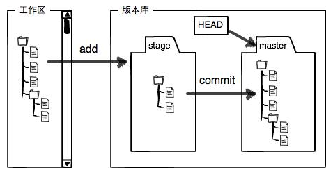
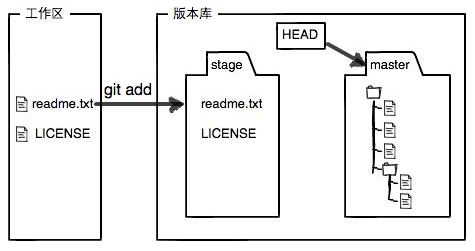
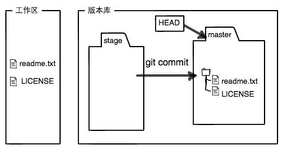

# GIT简介
## 1.诞生
> 1991年Linus创建了开源的Linux，并不断发展壮大，称为最大的服务器系统软件。最开始Linux的开源开发者是将自己代码发给Linus，再由Linus手动将代码进行合并。但是随着队伍的不断壮大，很难再继续用手工合并代码的方式进行管理。Linus本人是反对CVS、SVN的其他商用软件比较好用却又是收费的，这与Linux的开源精神不符。2002年BitKeeper原意授权Linux社区免费使用版本控制系统，2005年因社区中有人试图破解BitKeeper的协议，BitKeeper得知后要收回对其的免费使用权。

在这种形势下，Linus花了两周时间自己用C写了一个分布式版本控制系统，这就是Git！一个月之内，Linux系统的源码已经由Git管理。
## 2.集中式分布式
> 集中式版本控制系统，版本库是集中存放在中央服务器的，而干活的时候，用的都是自己的电脑，所以要先从中央服务器取得最新的版本，然后开始干活，干完活了，再把自己的活推送给中央服务器。中央服务器就好比是一个图书馆，你要改一本书，必须先从图书馆借出来，然后回到家自己改，改完了，再放回图书馆。集中式版本控制系统最大的毛病就是必须联网才能工作，如果在局域网内还好，带宽够大，速度够快，可如果在互联网上，遇到网速慢的话，可能提交一个10M的文件就需要5分钟，这还不得把人给憋死啊。

> 分布式版本控制系统根本没有“中央服务器”，每个人的电脑上都是一个完整的版本库，这样，你工作的时候，就不需要联网了，因为版本库就在你自己的电脑上。既然每个人电脑上都有一个完整的版本库，那多个人如何协作呢？比方说你在自己电脑上改了文件A，你的同事也在他的电脑上改了文件A，这时，你们俩之间只需把各自的修改推送给对方，就可以互相看到对方的修改了。
和集中式版本控制系统相比，分布式版本控制系统的安全性要高很多，因为每个人电脑里都有完整的版本库，某一个人的电脑坏掉了不要紧，随便从其他人那里复制一个就可以了。而集中式版本控制系统的中央服务器要是出了问题，所有人都没法干活了。
在实际使用分布式版本控制系统的时候，其实很少在两人之间的电脑上推送版本库的修改，因为可能你们俩不在一个局域网内，两台电脑互相访问不了，也可能今天你的同事病了，他的电脑压根没有开机。因此，分布式版本控制系统通常也有一台充当“中央服务器”的电脑，但这个服务器的作用仅仅是用来方便“交换”大家的修改，没有它大家也一样干活，只是交换修改不方便而已。
# 安装Git
## Linux系统
```bash
# 命令行输入命令进行安装
sudo apt-get install git
# 老一点的Debian或Ubuntu Linux，要把命令改为
sudo apt-get install git-core
# 安装完成后输入git查看是否安装成功
git
```
## Mac OS X
### 方法一
安装homebrew，然后通过homebrew安装Git，[homebrew文档](http://brew.sh/)
### 方法二
直接从AppStore安装Xcode，Xcode集成了Git，不过默认没有安装，你需要运行Xcode，选择菜单“Xcode”->“Preferences”，在弹出窗口中找到“Downloads”，选择“Command Line Tools”，点“Install”就可以完成安装了

## Windows
在Windows上使用Git，可以从Git官网直接[下载安装程序](https://git-scm.com/downloads)

## 设置用户名邮箱
```bash
git config --global user.name "Your Name"
git config --global user.email "email@example.com"
```
# 创建版本库
版本库又名仓库，英文名repository，你可以简单理解成一个目录，这个目录里面的所有文件都可以被Git管理起来，每个文件的修改、删除，Git都能跟踪，以便任何时刻都可以追踪历史，或者在将来某个时刻可以“还原”。

1. 首先，选择一个合适的地方，创建一个空目录

2. 第二步，通过 `git init` 命令把这个目录变成Git可以管理的仓库
   ```bash
   git init
   ```

将文件添加到版本库
1. 使用命令git add <file>，注意，可反复多次使用，添加多个文件；
2. 使用命令`git commit -m <message>`，完成。
   ```bash
   git add <file>
   git commit -m <message>
   ```
# 操作
## 查看状态
1. `git status` 命令可以让我们时刻掌握仓库当前的状态
2. `git diff` 查看文件改动了那些地方，可以在提交前查看文件进行了那些修改，然后再添加到仓库做到心中有数
## 版本回退
1. `git log` 显示从最近到最远的提交日志，
   `git log --pretty=oneline` 每条日志一行显示
2. `HEAD`指向的版本就是当前版本
   ```bash
   # HEAD^表示上个版本 HEAD^表示上上个版本
   git reset --hard HEAD^ # 回退到上个版本
   git reset --hard <commit id> # 回退到指定版本
   ```
3. `git reflog` 查看命令历史，以便确定要回到未来的哪个版本

## 工作区和暂存区
Git与SVN的一个不同之处就是有暂存区的概念

### 工作区（Working Directory）
就是在电脑里能看见文件夹
### 版本库（Repository）
> 工作区有一个隐藏目录.git，这个不算工作区，而是Git的版本库。

> Git的版本库里存了很多东西，其中最重要的就是称为stage（或者叫index）的暂存区，还有Git为我们自动创建的第一个分支master，以及指向master的一个指针叫HEAD。


>把文件往Git版本库里添加的时候，是分两步执行的：
>
> 第一步是用git add把文件添加进去，实际上就是把文件修改添加到暂存区；
>
>第二步是用git commit提交更改，实际上就是把暂存区的所有内容提交到当前分支。
>
>因为我们创建Git版本库时，Git自动为我们创建了唯一一个master分支，所以，现在，git commit就是往master分支上提交更改。
>
>你可以简单理解为，需要提交的文件修改通通放到暂存区，然后，一次性提交暂存区的所有修改。

`git add` 后状态


`git commit` 后状态
